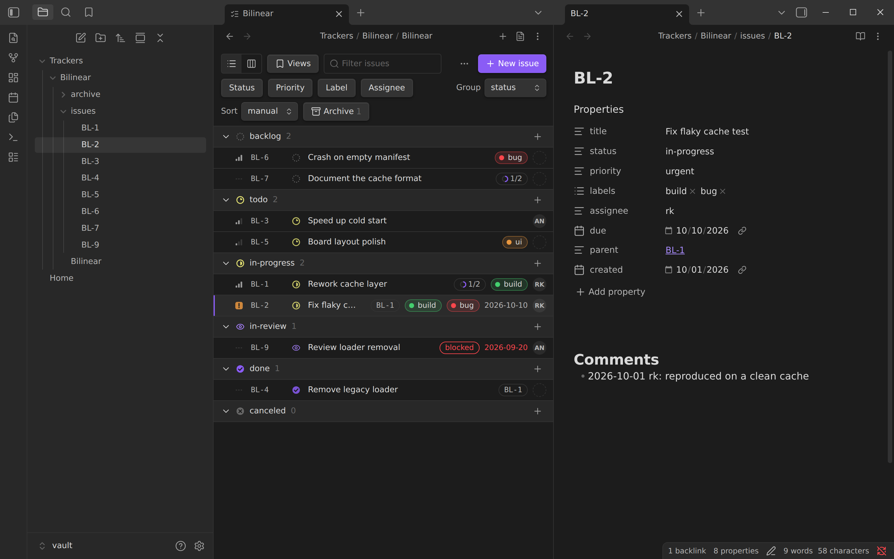
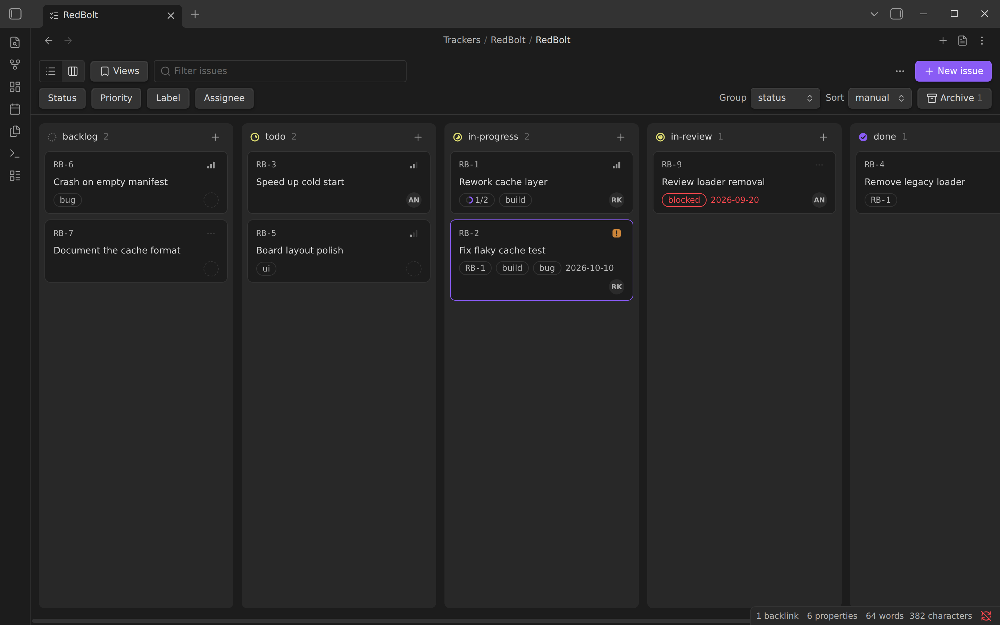
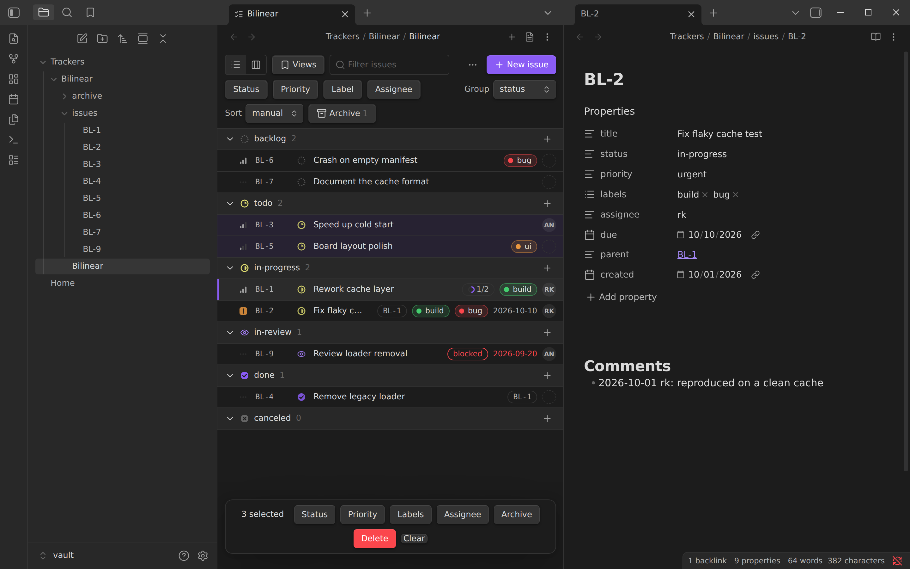
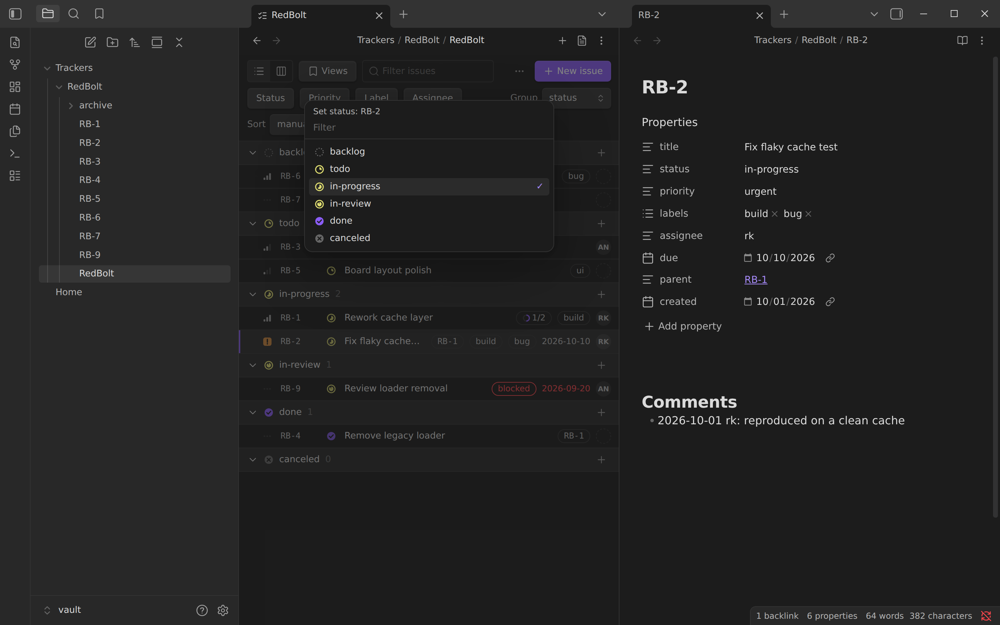
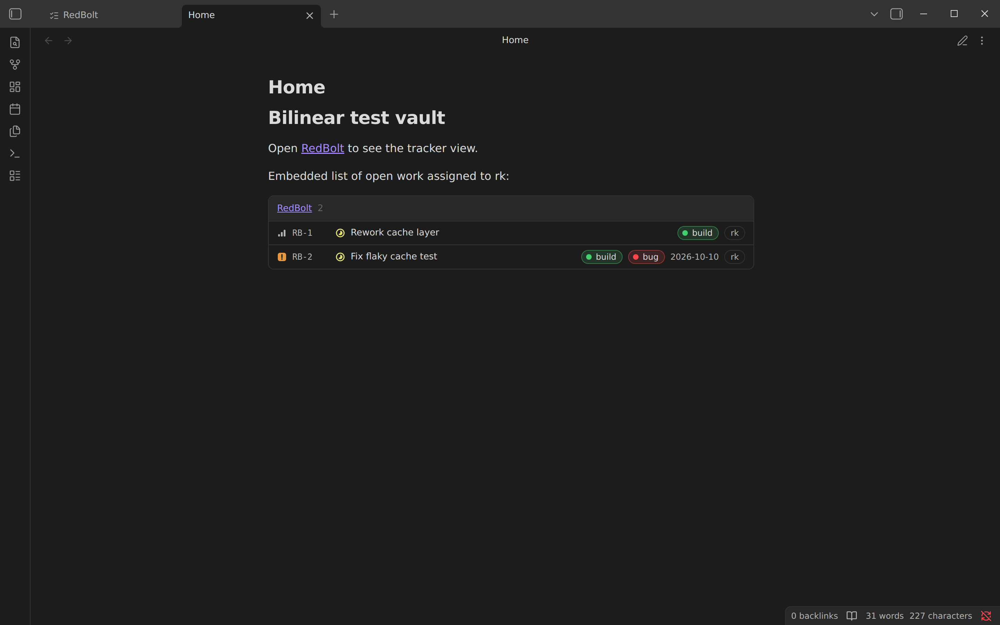
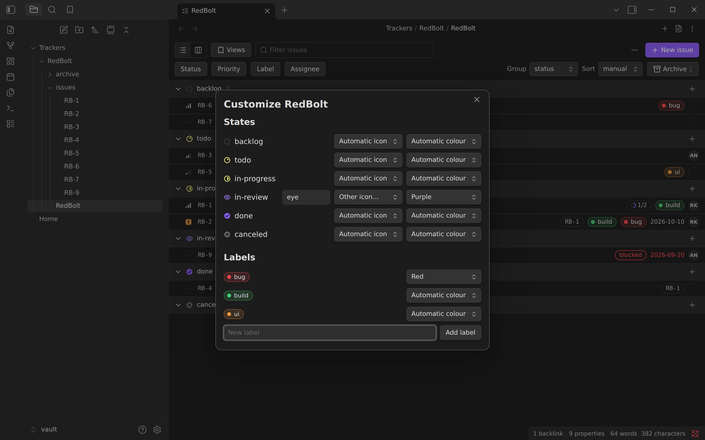

# Bilinear

A Linear-style issue tracker for Obsidian, stored as plain Markdown notes, with
a command-line client that works on the same files and runs through `npx`.

A tracker is a folder: one index note that lists the issues in order, and one
note per issue with its properties in frontmatter, kept in `issues/` while the
issue is open and in `archive/` once it is archived. Everything is
hand-editable; both tools preserve what they do not understand.

```
Trackers/Bilinear/
  Bilinear.md        index note: config, `## Issues`, `## Archive`
  issues/
    BL-9.md
    BL-13.md
  archive/
    BL-4.md
```



| Board | Bulk edit |
|---|---|
|  |  |

| Status picker | Embedded list |
|---|---|
|  |  |

| Customize states and labels |
|---|
|  |

The format is specified in [spec/FORMAT.md](spec/FORMAT.md). The plugin and the
CLI are tested against the same cases in `spec/fixtures/`.

## Repository layout

| Path | Contents |
|---|---|
| `spec/` | `FORMAT.md` and the shared fixtures |
| `plugin/` | The Obsidian plugin (Vue 3, Vite, TypeScript), the format and operations code it shares with the CLI, and the tests of both |
| `cli/` | The command-line client: `src/` and the npm package `obsidian-bilinear`. It builds to one file, `dist/bilinear.js`, with no dependencies |
| `manifest.json`, `versions.json` | The plugin manifest and its version history, at the root where Obsidian tooling expects them |
| `test-vault/` | A sample vault; the plugin build is linked into `.obsidian/plugins/bilinear` |
| `docs/screenshots/` | Screenshots of `test-vault/` in Obsidian's dark theme |

## CLI

The CLI needs Node 20 or later and nothing else. Run it without installing:

```sh
npx obsidian-bilinear list
```

or install it once, which puts `bilinear` on your `PATH`:

```sh
npm install -g obsidian-bilinear
```

The examples below say `bilinear`; with `npx`, write `npx obsidian-bilinear`
in its place. Each [release](https://github.com/rokups/obsidian-bilinear/releases)
also carries the CLI as a single file, `bilinear.js`, that `node` runs as it is.

```sh
bilinear init Trackers/Bilinear --prefix BL
cd Trackers/Bilinear
bilinear new "Fix flaky cache test" --priority high --label build,bug
bilinear list --status todo,in-progress
bilinear set BL-1 status=in-progress assignee=rk labels+=ui due=2026-10-10
bilinear comment BL-1 "reproduced on a clean cache"
bilinear move BL-1 --top
bilinear archive --closed
bilinear lint --fix
```

| Command | Purpose |
|---|---|
| `init <folder> --prefix BL` | Create the folder, index note, `issues/` and `archive/` |
| `new "Title" [--status ..] [--priority ..] [--label ..] [--assignee ..] [--due ..] [--parent ..] [--top]` | Create an issue; prints the ID |
| `list [--status ..] [--label ..] [--assignee ..] [--priority ..] [--archived] [--all]` | List in index order |
| `show <ID>` | Print properties and body |
| `set <ID> key=value ...` | Change properties, including `title`. `key=` removes a key; `labels+=x` and `labels-=x` edit lists |
| `comment <ID> "text"` | Append a comment |
| `move <ID> --before <ID> \| --after <ID> \| --top \| --bottom` | Reorder |
| `archive <ID>... \| --closed` | Archive named issues or all closed ones |
| `unarchive <ID>...` | Restore |
| `rm <ID> [--force]` | Remove the line; move the note to the vault's `.trash/` |
| `adopt <ID>` | Add an index line for an orphan note |
| `label [name] [--color COLOR]` | List the labels, or add one and set its colour (`none` clears it) |
| `state [name] [--icon ICON] [--color COLOR]` | List the states, or set a state's icon and colour (`none` clears it) |
| `lint [--fix]` | Check and optionally repair consistency |
| `skill [--global \| --dir DIR] [--print]` | Install a skill that teaches an LLM agent to use the CLI |
| `instructions [FILE] [--print]` | Add instructions to `AGENTS.md` or `CLAUDE.md` to track work in this tracker |

- The tracker is taken from `--tracker PATH` (folder or index note), then
  `BILINEAR_TRACKER`, then a search upward from the working directory.
- The comment author is `--author`, then `BILINEAR_USER`, then `$USER`.
- `--json` on `list`, `show`, `new`, `label`, `state` and `lint`.
- `list` shows progress as `[1/2]` and `show` names the linked issues and
  their states; in JSON it is `progress: {done, total, issues}`.
- Colours are `red`, `orange`, `yellow`, `green`, `cyan`, `blue`, `purple`,
  `pink`, `gray`, or a hex value such as `#7c5cff`.
- State icons are one of the shapes `dashed`, `circle`, `quarter`, `half`,
  `three-quarters`, `check`, `cross`, or the name of any
  [Lucide](https://lucide.dev/icons) icon, such as `eye` or `rocket`.
- Colours and icons are stored in the index note, as
  `label-colors: [bug=red]`, `state-icons: [in-review=eye]` and
  `state-colors: [in-review=purple]`, so they can also be edited by hand.
- A tracker made before `issues/` existed, with open notes directly in the
  tracker folder, keeps working as it is; `bilinear lint --fix` moves the
  notes into `issues/`.
- Filters accept repeated flags or comma-separated values.
- `rm` finds the vault by searching upward for `.obsidian/`. Without one it
  refuses unless `--force` is given, which deletes the note.
- Exit codes: 0 success, 1 usage or not found, 2 lint problems found, 3 write
  conflict after retries, a note moved or deleted while the command ran, or
  the tracker stayed locked.
- Every command takes a lock on the tracker first, and so does every
  operation of the plugin, so scripts, agents, cron jobs and Obsidian can
  all work on one tracker at once without losing each other's changes or
  seeing half of an operation; they simply run in turn. The lock is a
  `.bilinear.lock` file in the tracker folder that exists only while an
  operation runs. A command waits up to 10 seconds for its turn; set
  `BILINEAR_LOCK_TIMEOUT` (seconds) to change that. `spec/FORMAT.md`
  section 3.2 has the details, and what is and is not covered when you type
  in a note while a script edits it.

### For LLM agents

Two commands set a coding agent up to use a tracker:

```sh
bilinear skill                                  # .claude/skills/bilinear/SKILL.md in this project
bilinear skill --global                         # ~/.claude/skills/, for every project
bilinear skill --dir .agents/skills             # another agent's skills folder
bilinear --tracker Trackers/Bilinear instructions            # into AGENTS.md, or CLAUDE.md if only that exists
bilinear --tracker Trackers/Bilinear instructions CLAUDE.md  # into the file named
```

- The skill describes the commands, the properties and the exit codes, and
  says when to use them. It is the same for every tracker.
- The instructions name one tracker, by its path from the file they are in,
  with its ID prefix and states, and tell the agent to track its work there:
  find or create an issue before starting, comment on it, close it when done.
  They sit between `<!-- bilinear:start -->` and `<!-- bilinear:end -->`;
  running the command again replaces that block and leaves the rest of the
  file alone.
- `--print` writes either to standard output instead of a file.

The CLI moves notes with a plain file move. Bare `[[BL-4]]` links survive;
path-style links in other notes are only rewritten when the plugin does the
move.

## Plugin

### Installing

The plugin is not in Obsidian's community list yet. Install it with
[BRAT](https://github.com/TfTHacker/obsidian42-brat), which works on desktop
and on the mobile apps:

1. Install and enable "BRAT" from Community plugins.
2. Run the command "BRAT: Add a beta plugin for testing" and enter
   `rokups/obsidian-bilinear`.
3. Enable "Bilinear" under Community plugins.

BRAT installs the latest [release](https://github.com/rokups/obsidian-bilinear/releases)
and can keep it up to date. To install by hand instead, download `main.js`,
`manifest.json` and `styles.css` from a release into
`<vault>/.obsidian/plugins/bilinear/`.

### Building

```sh
cd plugin
pnpm install
pnpm build        # type check, then dist/main.js, styles.css, manifest.json and ../cli/dist/bilinear.js
pnpm dev          # rebuild on change
pnpm test
```

To try it, open `test-vault/` in Obsidian and enable the Bilinear community
plugin; the vault's plugin folder is a link to `plugin/dist`. With the
hot-reload plugin installed, `pnpm dev` reloads it on every change. To install
it elsewhere, copy the three files in `plugin/dist` to
`<vault>/.obsidian/plugins/bilinear/`.

Notes with `bilinear: tracker` open in the tracker view instead of the Markdown
view. "Open as Markdown" in the view header (or the toggle command) switches
back, and the Markdown view of an index note has an "Open as tracker" button.
Opening an issue shows its note in a side split, where properties are edited
with Obsidian's own Properties UI. Changes made outside the plugin, by the CLI
or by sync, show up live.

- List layout grouped by status, priority, assignee or label; board layout
  with drag between columns.
- Drag to reorder when the sort order is "manual"; this rewrites the index.
- Filter by text, status, priority, label and assignee; saved views, kept in
  a `bilinear-views` code block in the index note.
- Coloured labels and state icons, both with sensible defaults. To change
  them, open "Customize states and labels…" from the `…` menu in the tracker's
  toolbar (also a command): pick an icon and a colour for each state, and a
  colour for each label. Right-clicking a label on a row, or in the labels
  picker, is a shortcut to its colour.
- Progress on every issue that has linked issues: its sub-issues, plus any
  issues its description links to, so a checklist of `[[BL-3]]` links in a
  note becomes a progress ring that follows those issues' states. Hover it for
  the list. A "blocked" marker shows while a `blocked-by` issue is open.
- Bulk edit on a multi-selection.
- "Note missing" rows with recreate and remove actions.

Commands: create tracker, new issue (from anywhere), toggle tracker / Markdown
view, archive closed issues, lint tracker, customize states and labels, add
comment to this issue.

Settings: the author name for comments, and the default folder for new
trackers.

| Key | Action |
|---|---|
| `C` | New issue |
| `J` / `K` | Move the cursor down / up |
| `Enter` | Open the issue note in the side split (`Shift+Enter` also focuses it) |
| `S` `P` `L` `A` | Set status, priority, labels, assignee |
| `X` | Toggle selection for bulk edit |
| `/` | Focus the filter |
| `Alt+Up` / `Alt+Down` | Reorder the issue |
| `Esc` | Clear the selection |

### Embedding a list

A `bilinear` code block shows a filtered, read-only list in any note:

````markdown
```bilinear
tracker: Trackers/Bilinear
status: todo, in-progress
assignee: rk
limit: 10
```
````

Keys: `tracker` (folder, index note or tracker name; optional inside a tracker
folder or when the vault has one tracker), `status`, `priority`, `label`,
`assignee` (`none` for unassigned), `search`, `archived`, `limit`.

## Releasing

Set the new version in `manifest.json`, `plugin/package.json` and
`cli/package.json`, add it to `versions.json` with the minimum Obsidian version
it needs, and check with `node scripts/check_version.mjs`. Commit, then tag
the commit with the bare version and push the tag:

```sh
git tag 0.2.0 && git push origin 0.2.0
```

The release workflow tests and builds the plugin and the CLI, publishes a
GitHub release with the files attached, and publishes the CLI to npm as
`obsidian-bilinear`. The publish uses npm's trusted publishing, so there is no
token to keep: on npmjs.com the package's settings name this repository and
`release.yml` as its trusted publisher.

## Testing

```sh
cd plugin && pnpm build && pnpm test
```

The build comes first because one test runs several CLI processes at once
from `cli/dist/bilinear.js`; it is skipped if that file is missing.

Each case in `spec/fixtures/<case>/` is a `before/` tracker folder, an
`op.json` describing one operation, and the `after/` folder expected. The
tests apply the operation twice, to the operations in memory and through the
command line on disk, and compare byte for byte; they also check that parsing
and re-serializing every fixture file is the identity. The fixtures cover each operation, every row of the consistency
table, and the YAML variants Obsidian emits.

`scripts/stress_obsidian.mjs` races the CLI against the plugin in a running
Obsidian: the plugin writing while the CLI reads, the reverse, both writing,
and text being typed into a note while the CLI or the plugin edits it. Every
edit carries its own marker, and the script reports each one that was
acknowledged and is missing afterwards. It drives the plugin through
`app.plugins.plugins.bilinear.ops`, the same operations the views use. Build
first, start Obsidian on a vault that has the plugin enabled with
`--remote-debugging-port=9333`, then:

```sh
node scripts/stress_obsidian.mjs --vault /path/to/vault --seconds 20
```

Manual checklist, in `test-vault/`:

- The index note opens as a tracker; toggling to Markdown and back works.
- Keyboard: every row of the table above.
- Drag a row within a group, into another group, and between board columns.
- With the view open, run `bilinear new`, `set` and `archive` in a terminal;
  the view follows.
- Delete an issue note in the file explorer; the row turns into "note
  missing"; recreate it.
- `bilinear lint` is clean after a session in the plugin.
- On a phone: the list scrolls, pickers open, an issue opens in a new tab.
  Drag and drop is desktop-only; use the pickers and `Alt+Up` / `Alt+Down`.

## Out of scope for v1

Cycles, estimates, multi-tracker roll-ups, notifications, and sync with Linear
or any other external service.

## License

Copyright (C) 2026 rk

Bilinear is free software; you can redistribute it and/or modify it under the
terms of version 2 of the GNU General Public License as published by the Free
Software Foundation. It is distributed in the hope that it will be useful, but
without any warranty; without even the implied warranty of merchantability or
fitness for a particular purpose. See [LICENSE](LICENSE) for the full text.
